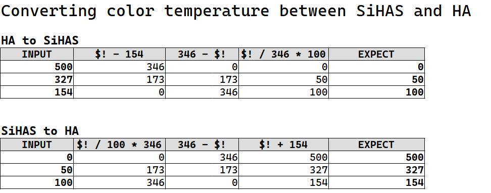

Just a memo for me :D


#### To bump version

Modify `manifest.json` version with result of below command

```bash
$ standard-version # for check, run with `--dry-run` option
✔ bumping version in manifest.json from 1.0.2 to 1.0.3
```

To enter develop env:
```bash
$ source /home/maya/workspace/hass/core/venv/bin/activate
$ hass -c  config
```


#### Assets naming

Images, should be named as it's md5 hashed hex-digit.
```bash
$ md5sum assets/3c436f4074c1097a5aec79d1bd94445f.png 
3c436f4074c1097a5aec79d1bd94445f  assets/3c436f4074c1097a5aec79d1bd94445f.png
```


## Detail about implementation

### SDM-300

#### Color temperature
SiHAS has `0` to `100` scale, and `0` means most high temperature, and `100` means most low temperature.  
HA has `154` to `500` scale, and `154` means lowest and `100` means highest.  
To convert color temperature scale between SiHAS and HA, look below table.  

